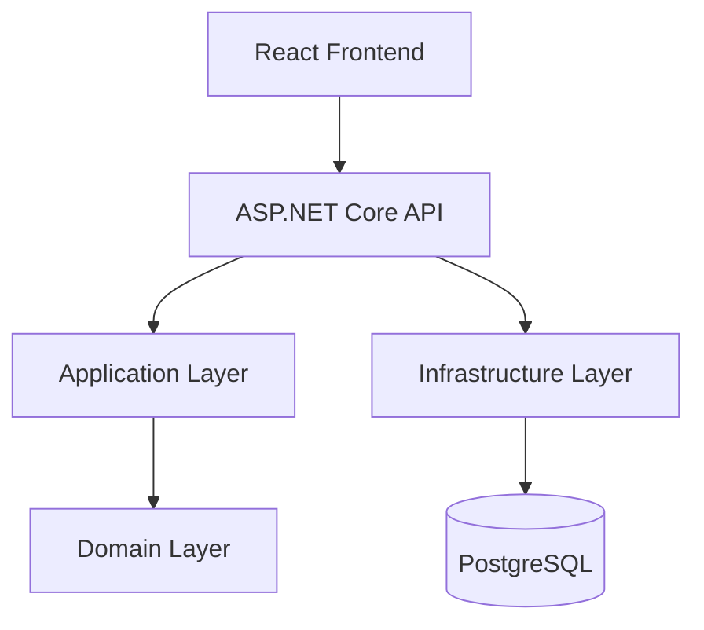

# 🚀 TaskManager - Fullstack (.NET 8 + React)

## ⚡ Visão Geral

TaskManager é uma aplicação fullstack de gerenciamento de tarefas (To-Do List) com autenticação JWT, desenvolvida com foco em **boas práticas de arquitetura, escalabilidade e testabilidade**.

### 🧱 Stack principal

- Backend: ASP.NET Core (.NET 8) + Clean Architecture
- Frontend: React + Vite + TypeScript
- Banco de dados: PostgreSQL
- Infraestrutura: Docker + Docker Compose
- Testes: xUnit, Moq, Vitest, React Testing Library

---

## ⚡ Quick Start

```bash
git clone <repo>
cd TaskManager
docker compose up --build
```

Acesse:

- 💻 Frontend: [http://localhost:3000](http://localhost:3000)
- 📄 Swagger API: [http://localhost:5000/swagger](http://localhost:5000/swagger)

---

## 📦 Funcionalidades

### 🔐 Autenticação

- Cadastro e login de usuários
- Autenticação via JWT
- Rotas protegidas por middleware
- Isolamento de dados por usuário

### 🗂️ Tarefas (CRUD)

- Criar tarefas
- Editar tarefas
- Excluir tarefas
- Marcar como concluída/pendente
- Filtrar tarefas (todas, pendentes, concluídas)
- Buscar tarefa por ID

---

## 🧱 Arquitetura

O backend segue rigorosamente **Clean Architecture**:

- **Domain** → entidades e regras puras de negócio
- **Application** → casos de uso e serviços
- **Infrastructure** → banco de dados, EF Core, segurança
- **WebApi** → controllers e camada HTTP



---

## 🧠 Decisões de Engenharia

- **JWT stateless** → facilita escalabilidade horizontal
- **Clean Architecture** → desacoplamento total do domínio
- **EF Core** → produtividade com controle de persistência
- **FluentValidation** → validações fora dos controllers
- **Middleware global** → tratamento padronizado de erros

---

## 🧪 Estratégia de Testes

### Backend

- xUnit para testes unitários
- Moq para mock de dependências
- Testes em Services e Controllers

### Frontend

- Vitest + Testing Library
- Testes de comportamento do usuário
- Simulação de chamadas à API

---

## 💻 Frontend

Estrutura modular com foco em tipagem forte:

```
src/
├── components/
├── pages/
├── context/
├── services/
├── types/
└── tests/
```

### Tecnologias:

- React + Vite
- TypeScript
- TailwindCSS
- Axios
- Context API

---

## 🔙 Backend

Estrutura baseada em Clean Architecture:

```
src/
├── TaskManager.Domain
├── TaskManager.Application
├── TaskManager.Infrastructure
└── TaskManager.WebApi

tests/
└── TaskManager.Tests
```

### Tecnologias:

- ASP.NET Core (.NET 8)
- Entity Framework Core
- PostgreSQL
- JWT Authentication
- FluentValidation
- Swagger

---

## ⚙️ Como executar manualmente

### Banco de dados

PostgreSQL rodando na porta `5432`

---

### Backend

```bash
cd Backend/src/TaskManager.WebApi
dotnet ef database update
dotnet run
```

API: [http://localhost:5000/swagger](http://localhost:5000/swagger)

---

### Frontend

```bash
cd Frontend
npm install
npm run dev
```

Frontend: [http://localhost:3000](http://localhost:3000)

---

## 👨‍💻 Autor

**Vinícius Storch**
